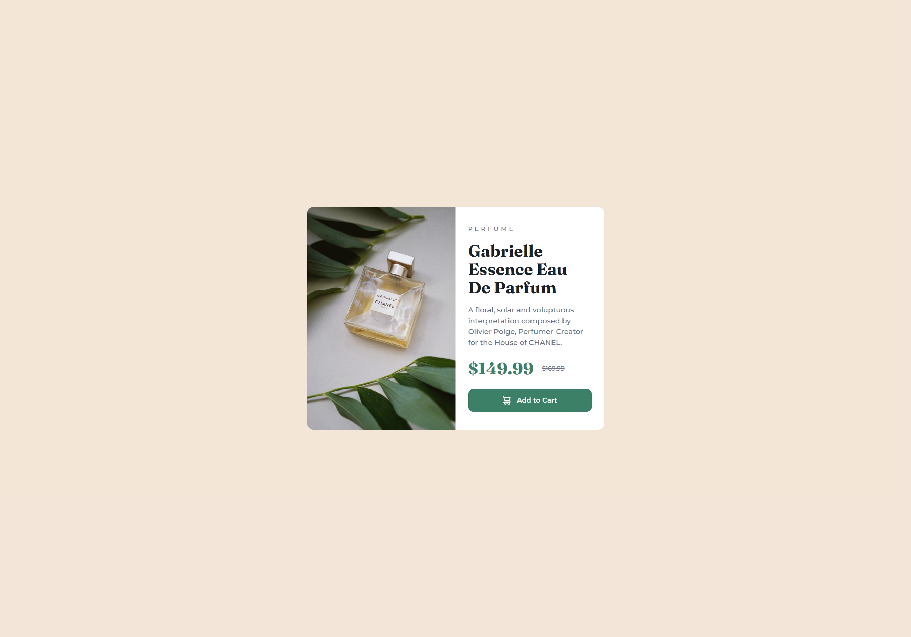

# Frontend Mentor - Product preview card component solution

This is a solution to the [Product preview card component challenge on Frontend Mentor](https://www.frontendmentor.io/challenges/product-preview-card-component-GO7UmttRfa). Frontend Mentor challenges help you improve your coding skills by building realistic projects. 

## Table of contents

- [Overview](#overview)
  - [The challenge](#the-challenge)
  - [Screenshot](#screenshot)
  - [Links](#links)
- [My process](#my-process)
  - [Built with](#built-with)
  - [What I learned](#what-i-learned)
  - [Continued development](#continued-development)
  - [Useful resources](#useful-resources)
- [Author](#author)

## Overview

### The challenge

Users should be able to:

- View the optimal layout depending on their device's screen size
- See hover and focus states for interactive elements

### Screenshot

### Links

- Solution URL: [Add solution URL here](https://github.com/antoniomontoia/product-preview-card-component-main)
- Live Site URL: [Add live site URL here](https://antoniomontoia.github.io/product-preview-card-component-main/)

## My process

### Built with

- Semantic HTML5 markup
- CSS custom properties
- Flexbox
- CSS Grid
- Mobile-first workflow

### What I learned

This project has been a valuable learning experience, allowing me to expand my skills in several areas:

SASS Essentials: I gained a solid understanding of how to use SASS to streamline my workflow. By leveraging SASS features such as variables and nesting, I was able to write more efficient and maintainable CSS code.

BEM Naming Conventions: I implemented BEM (Block, Element, Modifier) naming conventions in my CSS, which helped to improve the organization and readability of my code.

CSS Grid: I started to grasp the basics of CSS Grid, a powerful layout system that allows for more flexible and responsive design. 

Mobile-First Workflow: I experimented with a mobile-first workflow, designing and building the mobile version of the site first and then adapting it for desktop.

Relative Units: I started using relative units (such as em, rem, and percentages) for properties like size, margin, and font size. This helped to create a more flexible and responsive design, allowing the site to adapt seamlessly to different screen sizes and devices.

### Continued development

As I continue to grow and improve as a developer, there are several areas that I'd like to focus on in future projects:

Mastering CSS Grid: While I've made progress in understanding the basics of CSS Grid, I'd like to continue refining my skills and exploring more advanced techniques.

Advanced SASS Techniques: Now that I've gained a solid foundation in SASS, I'd like to explore more advanced techniques and features, such as using SASS functions and creating custom mixins.

 I'd like to continue pushing myself to create responsive designs that adapt seamlessly to different screen sizes, devices, and orientations. By mastering Grid, Flexbox, and SASS, I'll be well-equipped to tackle even the most complex responsive design challenges.

### Useful resources

- [Nekocalc PX-REM Converter](https://nekocalc.com/px-to-rem-converter) - This helped me getting my REM units right throughout the project with minimal effort.

- [SASS Guide](https://sass-lang.com/guide) - Perfect for starting out with SASS.

## Author

- Frontend Mentor - [@antoniomontoia](https://www.frontendmentor.io/profile/antoniomontoia)
- Dribbble - [@franissimo](https://www.dribbble.com/franissimo)